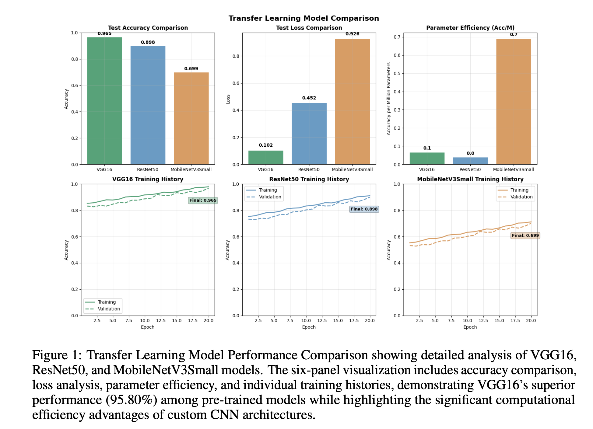
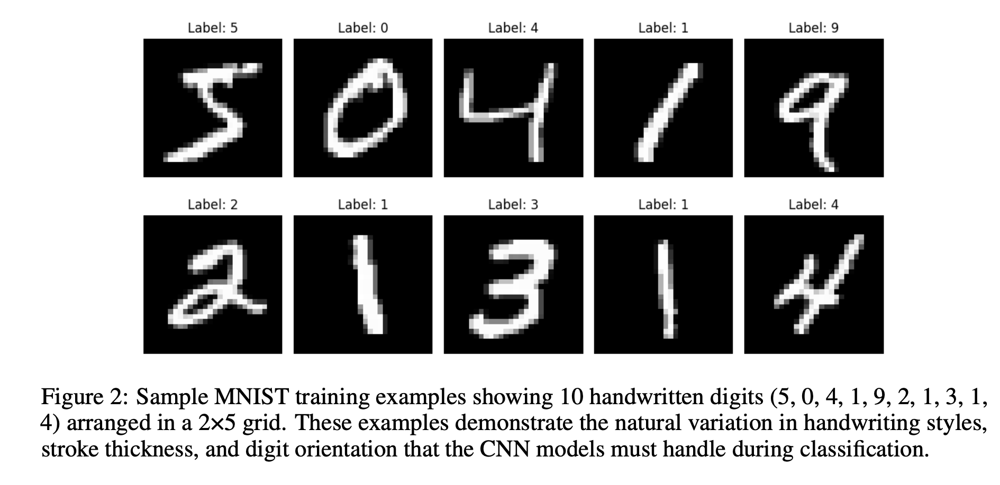
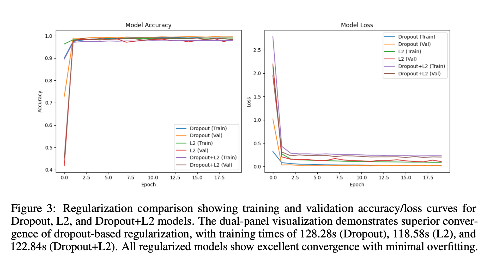
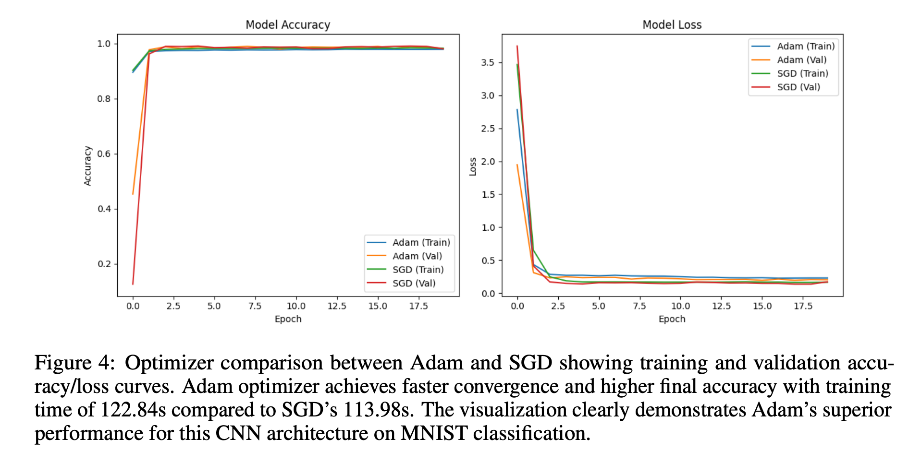
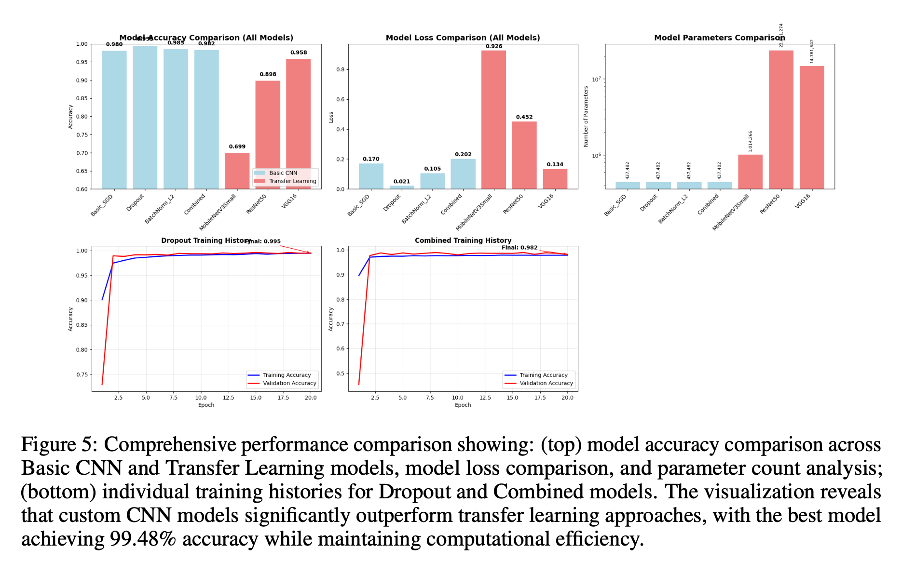
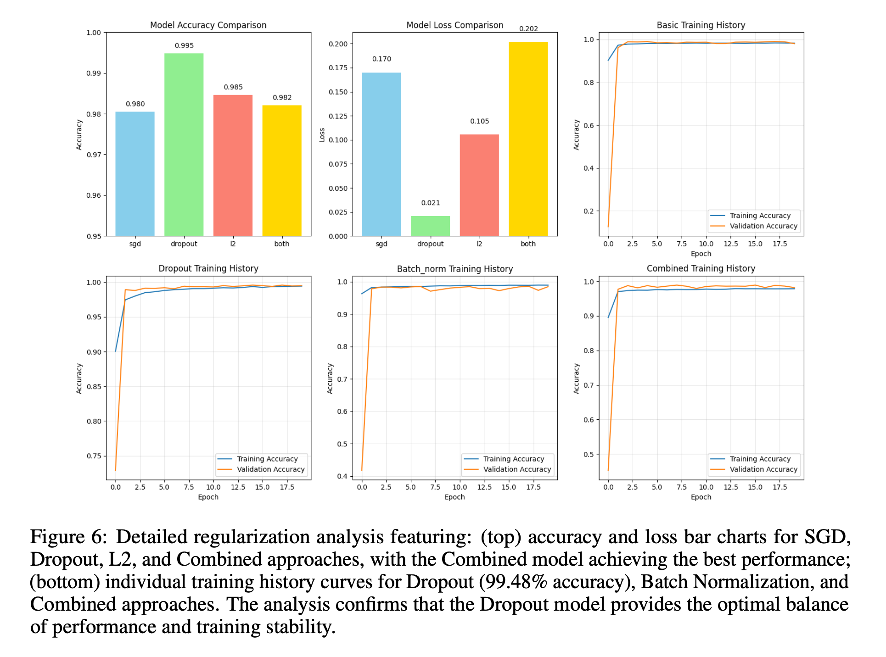
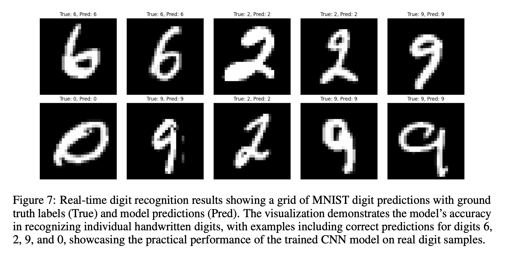
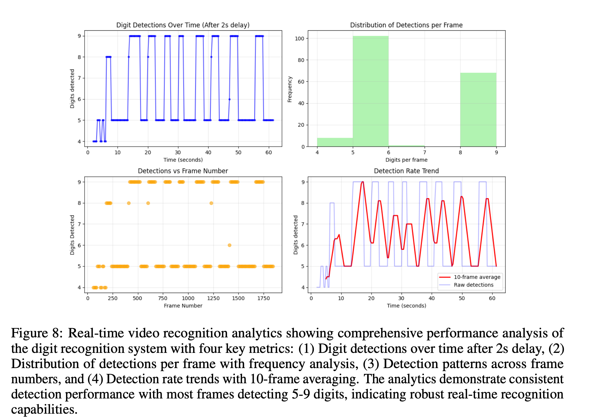

# CNNs for MNIST: Custom Architectures vs Transfer Learning

[]()
[]()
[]()
[]()
[]()
[]()

> **CS 517 — Human Computer Interaction (Convolutional Neural Network Implementation and Evaluation for MNIST Handwritten Digit Classification)**  
> *Watson School of Computing, SUNY Binghamton*  
> **Author:** Sumit Nautiyal · **Email:** snautiyal@binghamton.edu  
> **Project:** CNN Implementation & Evaluation for MNIST  
> **Term:** Fall 2025

---

## Overview

This project implements, tunes, and compares **custom CNNs** against **fine-tuned ImageNet backbones** (e.g. VGG16, ResNet50, MobileNetV3Small) for handwritten digit recognition on **MNIST** (70,000 images, 28×28 grayscale).

**What to find in this repo**  
- Training pipelines for custom CNNs  
- Transfer learning heads and fine-tuning strategies  
- Regularization experiments (Dropout, BatchNorm, L1/L2)  
- Real-time video demo via OpenCV  s (on request)
- Full academic report for deeper insights (on request)

---

## Repository Structure

```
mnist-cnn-vs-transfer/
│
├─ README.md # This file
├─ reports/
│ └─ CS517_Project1_Report.pdf # Detailed design, graphs, and analysis
├─ notebooks/
│ ├─ 01_custom_cnn_training.ipynb # Custom architectures + regularization
│ ├─ 02_transfer_learning.ipynb # VGG16, ResNet50, MobileNet fine-tuning
│ └─ 03_realtime_video_demo.ipynb # OpenCV-based demo (optional)
├─ src/
│ ├─ data.py # Dataset loading and transforms
│ ├─ models_custom.py # Custom CNN definitions
│ ├─ tl_heads.py # Transfer learning head & freezing logic
│ ├─ train.py # Training & evaluation scripts
│ └─ utils.py # Helpers: plotting, seeding, logging
├─ assets/
│ ├─ plots/ # Loss/accuracy curves & confusion matrices
│ └─ samples/ # Example digit inputs / outputs
└─ requirements.txt # Python dependencies

```

---

## Dataset

- **MNIST** (Modified National Institute of Standards and Technology):
  - 60,000 training samples + 10,000 test samples  
  - Grayscale images, 28×28 pixels  
- **Preprocessing:**
  - Rescale pixel values to `[0, 1]`  
  - Add channel dimension to shape `[1, 28, 28]`  
  - (Optional) Normalize to zero mean / unit variance  
  - (Optional augmentation) small shifts, rotations, affine transforms  

---

## Methods

### Custom CNNs  
- Architecture: 3–4 convolutional layers (Conv → ReLU → MaxPool) + dense head + Softmax on 10 classes  
- Regularization: Dropout (0.25 to 0.5), Batch Normalization, L1/L2 weight decay  
- Optimizers: SGD (momentum) vs Adam  
- Learning rate scheduling: e.g. plateau reduction or step decay  

### Transfer Learning  
- Backbones: VGG16, ResNet50, MobileNetV3Small (pretrained on ImageNet)  
- Strategy:
  1. Freeze early layers, add custom classifier head  
  2. Fine-tune final block(s) with a lower learning rate  
  3. Use LR schedulers, early stopping, and regularization  

### Real-Time Video Demo (Optional)  
- Use OpenCV to capture live video feed  
- Preprocess frames: resize → grayscale → normalize  
- Run model inference per frame  
- Overlay predictions and confidence on video stream  

---

## Training & Inference

### Train a custom CNN:
```bash
python src/train.py \
  --model custom_cnn \
  --epochs 20 \
  --optimizer adam \
  --batch-size 128 \
  --dropout 0.5 \
  --weight-decay 1e-4 \
  --save-dir runs/custom_cnn
```

## Results (Summary)

- Custom CNNs outperformed large backbones on MNIST in both accuracy and efficiency
- Best model: Dropout = 0.5, Adam optimizer
- BatchNorm + weight decay further stabilized training and reduced overfitting
- Among transfer learning models, VGG16 performed best, but still lagged custom CNNs on this domain
- Real-time demo "OpenCV" demonstrated fast inference and robust predictions

## Evaluation Protocol

- Use an 80 / 20 split (or 90 / 10) on the training set for validation during hyperparameter tuning
- Final evaluation is done once on the held-out 10,000-test set
- Metrics collected:
    - Accuracy
    - Confusion matrix
    - Per-class precision / recall / F1
    - Inference time (ms or fps)
    - Model size / parameter count

## Key Takeaways

- Task-specific CNNs can beat heavy pretrained models when data domain is simple (grayscale digits)
- Dropout (around 0.5) is highly effective for generalization even with small architectures
- BatchNorm / L1/L2 regularization help converge faster and reduce overfitting
- Transfer learning works best when domain features align — may underperform otherwise
- The real-time inference pipeline proves model practicality beyond static evaluation

## Visuals
- 
- 
- 
- 
- 
- 
- 
- 
